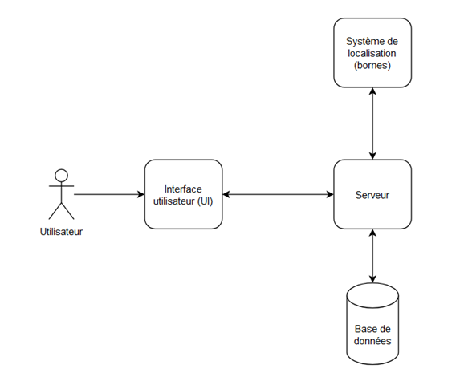
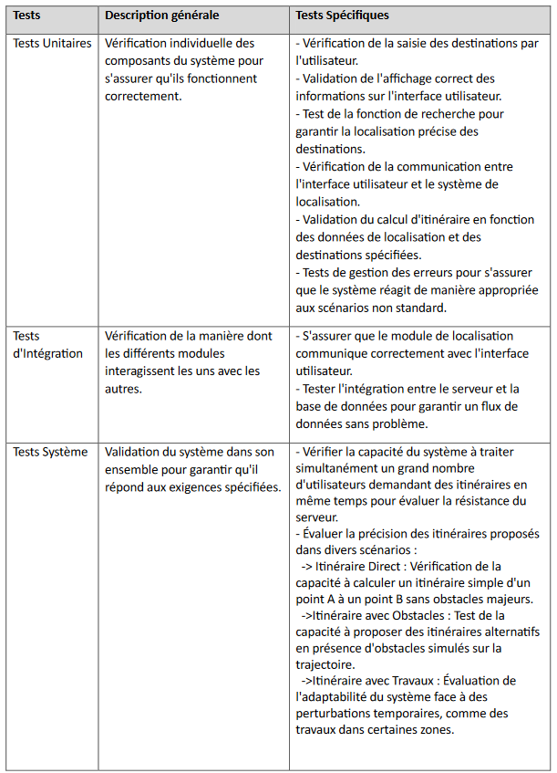

# Application de guide au sein du Bâtiment Sophie Germain - Université Paris Cité
## Projet de Master 1 Informatique

### Contexte

Le bâtiment Sophie Germain de l'Université Paris Cité accueille un
nombre important d'étudiants et d'enseignants chaque année. Afin de
simplifier leurs déplacements au sein de cette infrastructure, le
projet a pour objectif de développer un logiciel de navigation
intuitif. Ce logiciel vise à offrir aux utilisateurs, notamment aux
étudiants et aux enseignants, une solution pratique pour localiser
rapidement les salles de cours, les bureaux et autres points d'intérêt
essentiels du bâtiment.
 
### Enjeu principal

Optimiser la mobilité au sein du bâtiment, quelles que soient les
circonstances, en fournissant une solution de navigation efficace pour
garantir une expérience fluide et pratique aux étudiants et
enseignants.

### Architecture globale du projet

**1) Interface Utilisateur (UI) :**
- Une interface conviviale permettant aux utilisateurs de saisir leur
  destination ou de parcourir une carte interactive du bâtiment.
- Affichage des informations pertinentes, telles que les salles de
  cours, bureaux, escaliers et ascenseurs.

**2) Système de Localisation :**
- Utilisation de bornes placées stratégiquement pour permettre la
  triangulation et la localisation précise des utilisateurs.
- Possibilité d'intégrer des technologies comme le Bluetooth,
  l'ultrason, ou d'autres méthodes de localisation en intérieur.

**3) Serveur :**
- Gestion des requêtes des utilisateurs et des interactions avec la
  base de données.
- Calcul des itinéraires en fonction des informations de localisation
  et des destinations spécifiées.

**4) Base de Données (BD) :**
- Stockage des informations cartographiques du bâtiment, y compris la
  disposition des salles, des escaliers, et des autres points
  d'intérêt.
- Enregistrement des coordonnées des bornes pour la triangulation.

### Fonctionnalités clés (Intermédiaires)

**Localisation des Utilisateurs :**
- Permettre aux utilisateurs de se localiser dans le bâtiment en temps réel.
- Fournir des informations précises sur la position actuelle, y
  compris l'étage et la salle. 

**Interface Utilisateur Conviviale :**
- Concevoir une interface utilisateur conviviale et intuitive pour
  assurer une expérience utilisateur positive. 
- Intégrer des fonctionnalités de recherche pour permettre aux
  utilisateurs de trouver rapidement des destinations. 

**Navigation Intuitive :**
- Proposer un itinéraire optimal pour atteindre une destination
  spécifique dans le bâtiment. 
- Afficher la navigation étape par étape sur l'interface utilisateur.

### Extensions possibles

- Intégration et personnalisation de l’emploi du temp de l’étudiant.
- Réception de notifications pour les cours et les changements importants. 

### Testabilité

### Technologies

1. **Interface Utilisateur (UI):**
   - Langages Front-end: HTML, CSS, JavaScript pour la création d'une
     interface web conviviale. 
   - Framework Front-end: Utilisation de frameworks comme React ou
     Vue.js pour simplifier le développement et améliorer la
     réactivité de l'interface utilisateur. 
   - Cartographie Interactive: Utilisation de bibliothèques JavaScript
     comme Leaflet pour intégrer une carte interactive du bâtiment. 

2. **Système de Localisation:**
   - Bluetooth Low Energy (BLE): Les balises Bluetooth Low Energy
     (BLE) émettent des signaux à intervalles réguliers. Les
     dispositifs des utilisateurs (comme un smartphone ou un
     dispositif dédié) peuvent détecter ces signaux et mesurer la
     force du signal (RSSI - Received Signal Strength Indication).
   - Triangulation basée sur BLE: En utilisant la force du signal
     Bluetooth mesurée depuis au moins trois balises, on peut
     effectuer une triangulation pour estimer la position de
     l'utilisateur. Plus la force du signal est forte, plus
     l'utilisateur est proche de la balise. En combinant les forces du
     signal de plusieurs balises, on peut déterminer une position
     approximative. 

3. **Serveur:**
   - Langage Backend: Python (Flask ou Django)
   - Communication: Protocole HTTP pour gérer les requêtes des
     utilisateurs et les interactions avec la base de données. 
   - Calcul d'Itinéraire: Mise en place d'un algorithme de calcul
     d'itinéraire, tel que Dijkstra ou A*.

4. **Base de Données (BD):**
   - Système de Gestion de Base de Données (SGBD): MySQL, PostgreSQL
     ou MongoDB en fonction des besoins de stockage et de recherche. 
   - Modélisation: Conception d'une structure de base de données pour
     stocker les informations cartographiques du bâtiment, les
     coordonnées des bornes, etc.

### Originalité du Projet
L'originalité de ce projet réside dans sa combinaison de technologies
pour créer une solution de navigation personnalisée au sein du
Bâtiment Sophie Germain, adaptée aux besoins spécifiques des étudiants
et des enseignants de l'Université Paris Cité. 

### Pourquoi ce n’est pas qu’un collage d’API ?
Plutôt que de simplement coller ensemble des API existantes, le projet
s'efforce de développer une solution sur mesure pour optimiser la
mobilité au sein du bâtiment. En intégrant des technologies telle que
des technologies telles que Bluetooth Low Energy (BLE) pour la
localisation en intérieur et en mettant en œuvre une triangulation. 

### Calendrier/Jalons

- **Mois 1 : Conception et Planification**
  - Semaines 1-2 : Définir les spécifications détaillées du projet.
  - Semaines 3-4 : Commencer la modélisation des étages du bâtiment
    Sophie Germain, lancer les premières initiatives pour la sécurité
    des données.

- **Mois 2 : Implémentation de la Localisation et Personnalisation**
  - Semaines 5-6 : Intégrer les capteurs et lancer la mise en œuvre de
    la triangulation pour la localisation précise de l'utilisateur. 
  - Semaines 7-8 : Finaliser la modélisation des étages 2 et 3,
    commencer le travail sur la personnalisation de l'emploi du
    temps. 

- **Mois 3 : Fonctionnalités d'Informations et Liens vers les Cours**
  - Semaines 9-10 : Utiliser les données de localisation pour fournir
    des informations détaillées sur le chemin à suivre pour atteindre
    la salle de cours désirée. 
  - Semaines 11-12 : Intégrer des informations sur les salles de
    cours, les horaires de la bibliothèque, et les
    toilettes. Commencer à mettre en place des liens vers les cours. 

- **Mois 4 : Notifications, Rappels et Finalisation**
  - Semaines 13-14 : Mettre en place un système de notifications et de rappels.
  - Semaines 15-16 : Finaliser la personnalisation de l'emploi du
    temps, effectuer une première évaluation de la sécurité des
    données. 

- **Mois 5 : Tests et Améliorations**
  - Semaines 17-18 : Tests Préliminaires / Optimisation et Raffinement
    - Effectuer des tests préliminaires pour évaluer la fonctionnalité
      globale du système. 
    - Identifier les éventuels problèmes ou ajustements nécessaires.
    - Optimiser les performances du système en fonction des résultats des tests.
    - Raffiner l'interface utilisateur et les fonctionnalités en
      fonction des retours obtenus. 
  - Semaines 19-20 : Tests de Validation/Documentation et Livraison
    - Effectuer des tests de validation approfondis pour garantir la
      stabilité et la fiabilité du système. 
    - Corriger les bogues ou les problèmes éventuels identifiés lors des tests.
    - Finaliser la documentation complète du projet.
    - Préparer le projet pour la livraison, en incluant toutes les ressources nécessaires.
